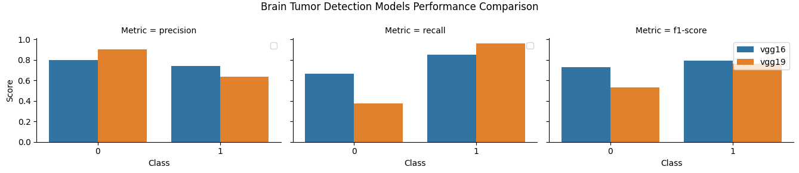
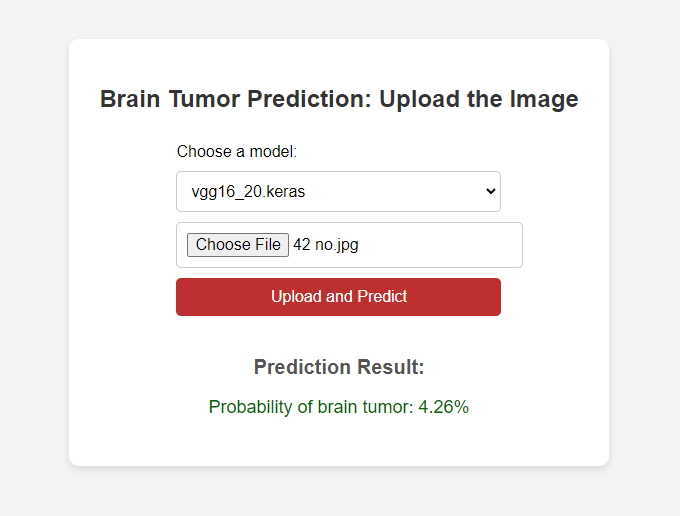

## Setup
Clone the repository and execute following commands to set up environment and dependencies

Create the Conda environment using environment.yaml

```bash
conda env create -f environment.yaml
```

use pip to install dependencies listed in requirements.txt

```bash
pip install -r requirements.txt
```

Next, obtain kaggle access key , then set username and access key environment variables. Follow instructions from "API credentials" section of following document
https://github.com/Kaggle/kaggle-api/blob/main/docs/README.md


## Data
Download data from kaggle

```bash
python download_data_from_kaggle.py
```

Set PYTHONPATH to include src folder

```bash
set PYTHONPATH=%PYTHONPATH%;C:\path\to\project\brain_tumor_prediction\src
```

## Usage

Train the model

```bash
python main.py --task train --epochs 20 --model vgg16
```

Load the trained model

```bash
python main.py --task load
```

## Command-Line Arguments

| Argument      | Type   | Default               | Description                                                                                                                                  |
|---------------|--------|-----------------------|----------------------------------------------------------------------------------------------------------------------------------------------|
| `--model`     | `str`  | `"vgg16"`             | Base model name (options are vgg16, vgg19)                                                                                                   |
| `--epochs`    | `int`  | `10`                  | Number of epochs for training                                                                                                                |
| `--task`      | `str`  | `"load"`              | Task to perform. Options are: `train` to train the model and save the trained model, or `load` to load the saved model and perform evaluation, or `visualize` to plot performance metrics across models|
| `--data_dir`  | `str`  | `"../data/raw/"`      | Folder to load the data from. Default is `../data/raw/`                                                                                      |
| `--model_dir` | `str`  | `"../trained_models/"`| Folder to save or load the model. The default directory is `../trained_models/`.                                                             |
| `--models_v`  | `str`  | `"vgg16;vgg19"`       | Base Model Names to show visualizations for(separated by semicolon) (default: vgg16;vgg19)                                                   |


Example Performance Metrics Comparison



## Using API and frontend

When you have trained models, you can expose prediction via api and use frontend to interact with the api

```
cd api
python main.py
```

This will create api endpoint on port 8080

To run the frontend

```
cd frontend
python -m http.server 8000
```

On your browser, navigate to
http://127.0.0.1:8000/

Example output



